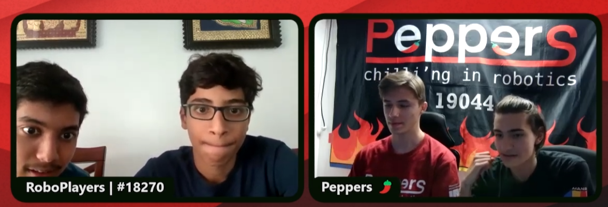

## Presidential Recognition

### Presidential Volunteer Service Award - Gold Medal (2024)

##### Total Number of hours across all tiers: 180

## TIER 1: SPREAD AWARENESS OF STEM & Robotics
**Events Conducted:** 20 | **People Impacted:** 5,375 | **Hours Volunteered:** 53

**STEM Fair Presentations** - Presented at community fairs, libraries, and schools to introduce STEM concepts and FIRST robotics programs to children and adults of all ages. 

**Specific Events:**
- **Northside Library STEM Fair** - Hours Spent: 5; People Impacted: 1,500
- **Clay All Parent Robotics Night** - Hours Spent: 2; People Impacted: 25
- **Genesis Women's Shelter** - Hours Spent: 5; People Impacted: 25
- **Preschool FLL Intro** - Hours Spent: 3; People Impacted: 100
- **Clara Love Elementary** - Hours Spent: 4; People Impacted: 100
- **Open House at Community Center** - Hours Spent: 8; People Impacted: 1,000
- **North Texas Food Bank** - Hours Spent: 3; People Impacted: 30
- **Texas Instruments Bring Your Kids to Work** - Hours Spent: 4; People Impacted: 2,000
- **Mrs. Manju's Montessori** - Hours Spent: 2; People Impacted: 15
- **Robotics Booth at Community Center** - Hours Spent: 2; People Impacted: 30
- **Robot Petting Zoo** - Hours Spent: 3; People Impacted: 500
- **Dallas AI Conference** - Hours Spent: 2; People Impacted: 50

These are just some of the events that I have conducted. Most of these were organized by me, and not as part of a bigger event. 

**Community Impact:**
- Presented to over 5,000 children at community events, libraries, and schools
- Conducted 20+ outreach events to spread awareness of STEM
- Introduced hundreds of families to FIRST Lego League and FIRST Tech Challenge programs
- Introduced robotics to students from multiple schools and community centers

## TIER 2: SHARING KNOWLEDGE BY TEACHING
**People Impacted:** 2,579 | **Hours Volunteered:** 120

### Formal Robotics Classes (2022-2025)
**Primary Robotics and CAD Instructor** - Taught comprehensive robotics programs focusing on developing the skills necessary for competitive robotics.

**Program Scale and Impact:**
- Taught over 200 students across grades 3-10 in competitive robotics and computer-aided design
- Raised over $8,000 annually through structured weekly educational programs
- Collaborated with FTC teams within DFW and globally to share knowledge and present at conferences
- Helped transform local community center into a hub of STEM learning
- Many students have continued STEM education and joined or started robotics teams

**Community Center Classes:** 2-3 hours weekly teaching robotics and engineering concepts to elementary and middle school students at a local community center
- **Beginner Robotics Classes:** One-hour Saturday classes covering mechanical systems (gears, motors), basic programming concepts, and robot movement and control, held weekly for 3.5 years
- **Intermediate Classes:** FIRST Lego League (FLL) preparation focusing on modular attachments, programming, and presentation skills, held weekly for 3.5 years
- **CAD Classes:** Taught OnShape computer-aided design to 20 students covering part studios and assemblies for FIRST Tech Challenge participation weekly for 2 years
- **Summer Advanced Classes:** 2.5 hour long classes designed to teach all technical aspects of FTC, like building, CAD, and programming, held every week for the entire summer
- **Learning over multiple years:** Wide range of classes for different age groups, allowing students to advance through different levels over multiple years

### Knowledge Sharing & Collaboration
Collaborated with FTC teams to share technical knowledge and present research at conferences:

**Specific Events:**
- **FLYSET Conference** - Collaborated with FTC 8565 and presented our innovative shopping cart swerve drivetrain. Hours Spent: 26; People Impacted: 500
- **Podcast for Brainstorming Ideas** - Collaborated with FTC 19044 based in Romania & presented in a virtual podcast to brainstorm design and strategy. Hours Spent: 5; People Impacted: 300
- **Mentoring SR1 from Mississippi** - Hosted a CAD Bootcamp to get them started on CAD and design ideas quickly. Hours Spent: 20; People Impacted: 20
- **Robotics for Everyone** - Open-sourced versatile 3D printable parts and reduced the cost of robotics kits from \$1000 to $150. Hours Spent: 50; People Impacted: 800+
- **Open Source Pure Pursuit Pathing Library** - Worked with another robotics team and created a custom pathing library for the autonomous period using the pure pursuit algorithm. Hours Spent: 20
- **Introduction to CAD** - Created youtube videos on how to use CAD and shared them with teams all around the world, including Austrailian and South African teams. Hours Spent: 25
- **IGNITE - Outreach with TexPand, South Africa** - Collaborated with team 18763 Texpand based in South Africa in order to establish competitive teams in the region. Formed an organization called Ignite Robotics. Hours Spent: 10
{: .project-image} {: .project-image}

## TIER 3: CONNECTIONS: LOCAL AND AROUND THE WORLD
**Teams Mentored:** 12 | **People Impacted:** 180 | **Hours Volunteered:** 126

### Team Foundation and Mentorship
Start and mentor FLL and FTC teams with emphasis on FIRST values and seasonal competition success:

 

**Teams Mentored:**
- **23870 - Robo Avengers, Michigan** - 8hrs
- **24395 - Ekam, India** - 6hrs
- **22332 - Trojan Robotics, Dallas, TX** - 30hrs
- **23939 - Robo Rookies, Dallas, TX** - 13hrs
- **22201 - The Edge Robotics, Dallas, TX** - 10hrs
- **25197 - Circuit Breakers, South Africa** - 12hrs
- **6205 - Scarlet, Mississippi** - 15hrs
- **17632 - Aztroid, Mexico** - 6hrs
- **24693 - 1DEI, Kazakhstan** - 5hrs
- **21659 - Tesseract, New Hampshire** - 2hrs
- **3371 - Bötley Crüe, New York** - 4hrs
- **27117 - Byte Size Lions, Dallas, TX** - 15hrs

**Local Team Development:**
- Mentored students by sharing my expertise and experience. They work on an extremely limited budget but did great this season. Helped their FRC team win their first medal.

- **Our Proudest Moment** - Team 23870 - RoboAvengers is a team in Michigan that we started coaching this year. We reviewed their autonomous code and shared our Git Repository. They were the Winning Alliance Captain and Inspire Winner at their Qualifiers this season.

## Volunteering at FIRST Events

### FIRST Tech Challenge Community Support (2024-2025)
**Technical Event Volunteer** - Provide support at regional and state robotics competitions, as well as offseason events:

- Support field setup, team queueing, and keeping scores of the different robots on the field
- Assist teams with troubleshooting wiring, even when our team is competing against them
- Ensure smooth tournament operations serving 500+ participants per event

 