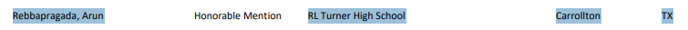

## Physics Competitions

### USA Physics Olympiad Honorable Mention 2025
**Honorable mention at USAPhO** - Placed in top 300 students nationwide in the USAPhO exam. The USA Physics Olympiad is one of the most prestigious physics competitions in the United States, covering almost all aspects of physics, such as mechanics, electricity and magnetism, optics, thermodynamics, relativity and quantum mechanics. 
{: .project-image}

## Computer Science Competitions

### USACO (USA Computing Olympiad)
**Silver Level Qualification (2023)** - Qualified for Silver level competition as a 9th grader, demonstrating advanced algorithmic problem-solving skills. USACO is the premier competitive programming competition for high school students in the United States.

### Project Euler
**Level 2 Solver Status** - Achieved Level 2 solver status (top 4% of all global users) by solving 63 math-based programming problems. Project Euler challenges programmers with mathematical problems that require both mathematical insight and programming skills.

## Hackathons & Programming Contests

### Battle of Brains Hackathon Dallas
- **2024:** Ranked 4th place among Dallas area competitors
- **2023:** Ranked 6th place among Dallas area competitors

This annual hackathon brings together the best young programmers from across the Dallas-Fort Worth metroplex for intensive problem-solving competitions.

### Lockheed Martin Code Quest
**2nd Place - Advanced Division** - Placed 2nd in the Advanced Division among all schools in Dallas-Fort Worth area. This competition challenges students with real-world programming problems.

## Math Competitions

### AIME Qualification (2025)
**American Invitational Mathematics Examination** - Achieved highest AMC score in school history over past 10 years, becoming only the second student in recent school history to qualify for AIME, with 5 problems solved. This qualification represents performance in the top 5% of all AMC participants nationwide.

### MOEMS E/M
**Gold Pin Recognition** - Earned Gold Pin recognition, placing in top 2% nationally in the Mathematical Olympiads for Elementary and Middle Schools competition.

### AMC 8
**Honor Roll** - Achieved Honor Roll recognition for exceptional performance on the American Mathematics Competition 8, demonstrating advanced mathematical problem-solving skills.

### Noetic Math Contest
**National Honor Roll** - Multiple years of National Honor Roll recognition for outstanding performance in this national mathematics competition.

 
