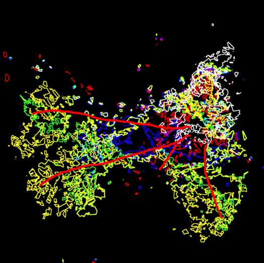
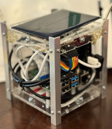
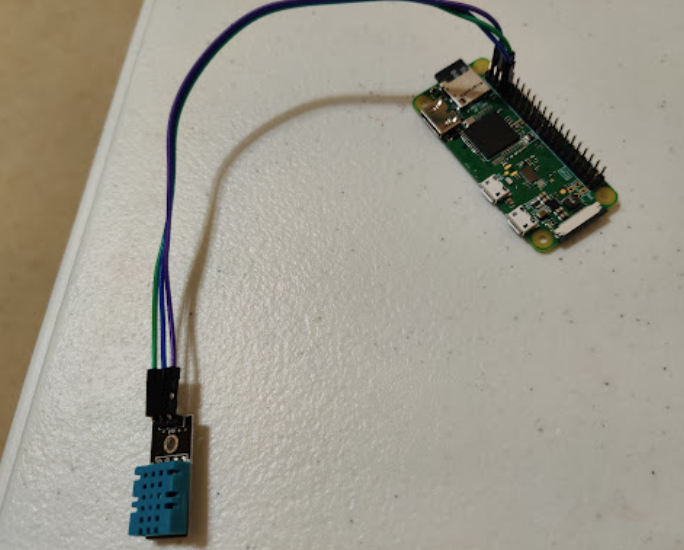
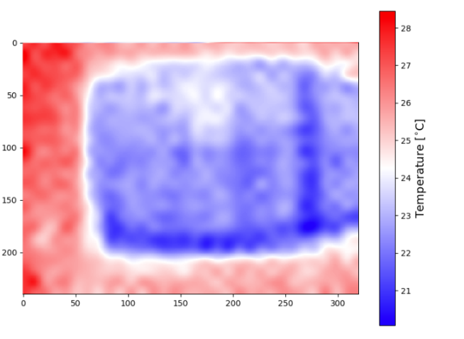

*For an overview of my project descriptions, see my [complete resume](resume.md). For research publications and work experience, see my [research & experience page](research-experience.md)*

## Netra Health Venture Capitalist Firm

### **Electrocardiogram Analysis Tool for Early Detection of Cardiac Events**

- Wrote a Python script that analyzed the ECG signal and detects when cardiac events are likely
- Finds R-Peaks and calculates the HRV
- When the HRV drops below a predetermined threshold, we can flag the data as high risk
- This code is able to generalize to multiple monitors, scales, and sampling rates
- I compared the result with data from a healthy to an unhealthy person and was able to find appropriate thresholds
- I can also detect when cardiac events are currently happening
- One version of the code runs efficiently using vectorizedd operations and another operates in a streaming manner. The code that is streaming still executes at around 3000x real time

[Code for the project](https://github.com/skandacode/ecg-wave-delineation-visualizer)

{: .project-image}
*This shows healthy data. There is no shading, showing a healthy individual*

{: .project-image}
*This shows unhealthy data. As you can see, areas under high risk are shown in blue.*

## **Space-Related R&D**

### **NASA HUNCH Micro-Rover Development** (2024-2025)
*Captain, Lead Designer, Builder, and Programmer*

#### **Features:**

- **Body** - The lunar regolith is abrasive, so we made the entire body of the rover out of 1/16" aluminum. By covering every hole, we made sure to completely isolate the electronics from the regolith. 
- **Dual Control Systems** - The rover can be controlled through either a remote control or computer-based radio command interface. The rover can be controlled through both a Bluetooth Low Energy connected controller, or autonomously controlled through Long Range Radio at the 915Mhz frequency. Commands consist of Python code which is executed on the rover. 
- **Wireless image capture and transmission** - Uses a high resolution camera in the M5 Stack Camera X to capture photos, and uses the built in ESP 32 as a Wifi Access point to send the images to a computer
- **Wireless Software Updates** - Over-the-air programming system. Our rover is capable of executing python code that was transmitted over the radio. Because of this, we are able to edit files on the rover, which allows us to make software updates without even taking the rover apart. This system was inspired by the Ingenuity mission in Mars. 
  
    **[Link to website](https://sites.google.com/cfbmail.com/nasa-hunch-lunar-rover/designs)**
    
    **[Link to latest CAD Model](https://cad.onshape.com/documents/b768e7ff74cb64a2bd957713/w/f866da644b5ce7340ff3ff36/e/6890e63dd318aa4fd2992dfc)**

### **CubeSat Development Projects**
**MIT Beaver Works Summer Institute - Build a CubeSat Challenge**
- **Wildfire Tracking and Prediction from Space** (2024-2025) 
The satellite uses computer vision algorithms to detect and predict wildfire movement from space using satellites. Used a color thresholding and contour detection to detect where the wildfires are, and used data from multiple passes to show fire spread. Then, the program makes predictions on where the fire will spread next. 

  **[Link to Cubesat CAD Model](https://cad.onshape.com/documents/659f951b2f3d6802c7789cdf/w/b8b9c379a43547fd131a2233/e/30e1710706289f5d181ec25f)**
  {: .demo-image}
  *The fire spread in the order of the white contour, the red contour, the blue, green, and finally yellow. The arrows show the direction of motion of the fire.*

- **Mudslide Detection and Impact Assessment** (2023-2024) 
  The CubeSat maps regions that are susceptible to mudslides by using machine learning, and alerting ground station if any new mudslides have been detected. 
  {: .project-image}

## **Robotics for Everyone Initiative**

### **Open-sourced library of 3D printable and laser cuttable parts**
- Developed a robotics kit that uses 3D printed and laser cut parts to reduce the cost of a robotics kit
- 3D printing is relatively cheap, and anyone can get access to them at their local library
- Laser cutted parts can be mass produced at scale, resulting in reduced costs
- This means that our build kit is significantly cheaper than stock alternatives
- We were able to reduce the cost of the robotics kit from **\$1000** to **\$150** while still providing the same educational benefits
- The purpose of this initiative was to increase accessibility of robotics kits in classrooms around the world

[Link to all of our CAD models](https://www.roboticsforeveryone.org/models)

[Github link to all models](https://github.com/Robotics4Everyone/Model-Library/branches/all)

{: .project-image}

## **Application Development**

### **Technocise Exercise Tracking Platform**
- Real-time human pose analysis through the PoseNet library. This was used to track the key points of the body, so whenever the body did an action, like a squat or a jumping jack, it is able to detect the motion and increment a counter. This way, it eliminates the reliance of a virtual instructor supervising all of the kids. 
- I incorporated this into a website which is able to work on any device. Also, we added a scoreboard and a leaderboard to increase competition between students in a class. 
- This website was used by my school, where over 30 people used the app, with over 5000 counts recorded. 

### **Sidewalk Shaper Reporting App**
- I led the creation of a mobile application built using visual programming blocks, making it accessible for deployment across Android devices and available on the Google Play Store.
- The app captures real-time GPS coordinates to ensure the exact location identification of infrastructure damage for city records. This makes the whole process of finding and repairing broken sidewalks more efficient. 
- The app emails photographs, GPS coordinates, and timestamp into structured reports sent directly to the city's maintenance departments. We collaborated with the city officials in Coppell and Lewisville to set up an official Sidewalk Shaper email address. 
- The app has a simple reporting process designed for citizen engagement. This allows for more community participation and helps fix the city's infrastructure.

### **Smart Container IoT System**
- The device is designed to address the critical issue where 50% of damaged cargo results from temperature and humidity fluctuations that can ruin vaccines, medicines, and food products. This happens during transit or storage.
- Used Raspberry Pi Zero WH as the core processing unit, providing compact monitoring capabilities for individual containers.
- The DHT11 sensor allowed us to have precise temperature and humidity monitoring with detection ranges from -67°F to 122°F and humidity sensing between 5% and 95%. This ensured that the solution could be used for all containers on storage areas.
- The app used an API which allowed us to have secure, real-time, data transmission as well as processing and data storage. The data is stored on a website. 
- Connected with the United Nations and FedEx for professional feedback.
{: .project-image}

### **Inexpensive Thermal Camera System for Detecting House Leaks**
- This DIY thermal camera helps detect heat loss in homes, which can account for up to 30% of energy waste, by visually identifying insulation gaps, air leaks, and overheating appliances—potentially saving $200–$400 per year on energy bills. 
- Device Specs: Has a 24×32 thermal resolution, real-time heatmap display, Raspberry Pi-powered, HDMI output, temperature detection range: -40°C to 300°C. Costs around \$100. Existing systems cost over \$1000. 
- Thermal Camera turns heat into colors, letting you see temperature differences on a screen.
- Spots inefficient heating or cooling areas, allowing you to take steps to reduce energy loss and save money on bills.
{: .demo-image}

 