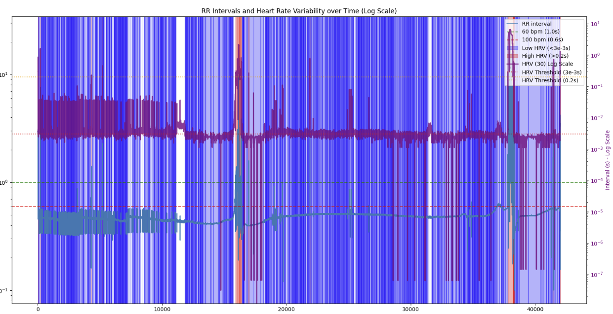
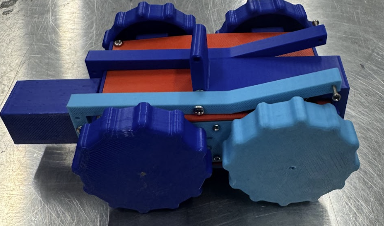

*For an overview of my project descriptions, see my [complete resume](resume.md). For research publications and work experience, see my [research & experience page](research-experience.md)*

## Netra Health Venture Capitalist Firm

### **Electrocardiogram Analysis Tool for Early Detection of Cardiac Events**
*Conducted novel, independent research in collaboration with Netra Health Venture Capitalist Firm*

 

Details
- Wrote a Python script that analyzed the ECG signal and detects when cardiac events are likely
- Finds R-Peaks and calculates the HRV
- When the HRV drops below a predetermined threshold, we can flag the data as high risk
- This code is able to generalize to multiple monitors, scales, and sampling rates
- Compares the result with data from a healthy to an unhealthy person and was able to find appropriate thresholds

 

Impact

 - Able to dectect heart failures, cardiac arrests, or other heart problems hours before the events take place
 - WRITE SOMETHING ELSE HERE 

 

[Code for the project](https://github.com/skandacode/ecg-wave-delineation-visualizer)

  

    
    

    This shows healthy data. There is no shading, showing a healthy individual
    

  

  

  
  

    This shows unhealthy data. The areas under high risk are shown in blue
  

## **Space-Related R&D**

### **NASA HUNCH Micro-Rover Development** (2024-2025)

*Captain, Lead Designer, Builder, and Programmer*

 

Details

- The lunar regolith is abrasive, so we made the entire body of the rover out of 1/16" aluminum
- The rover can be controlled through either a remote control or computer-based radio command interface. 
- Uses a high resolution camera in the M5 Stack Camera X to capture photos, and uses the built in ESP 32 as a Wifi Access point to send the images to a computer

Impact

 - Presented to NASA engineers and received direct feedback on rover design
 - Pitched project during two formal presentations

 
  
[Link to website](https://sites.google.com/cfbmail.com/nasa-hunch-lunar-rover/designs)
    
[Link to latest CAD Model](https://cad.onshape.com/documents/b768e7ff74cb64a2bd957713/w/f866da644b5ce7340ff3ff36/e/6890e63dd318aa4fd2992dfc)

  
  

    <em>Final iteration of NASA Micro-Rover</em>
  

### **CubeSat Development Projects**
*MIT Beaver Works Summer Institute - Build a CubeSat Challenge*
- **Wildfire Tracking and Prediction from Space** (2024-2025) - 
The satellite uses computer vision algorithms to detect and predict wildfire movement from space using satellites. Used a color thresholding and contour detection to detect where the wildfires are, and used data from multiple passes to show fire spread. Then, the program makes predictions on where the fire will spread next. 

 

  <a href="https://cad.onshape.com/documents/659f951b2f3d6802c7789cdf/w/b8b9c379a43547fd131a2233/e/30e1710706289f5d181ec25f">
    Link to Cubesat CAD Model
  </a>

  
  

    <em>The fire spread in the order of the white contour, the red contour, the blue, green, and finally yellow. The arrows show the direction of motion of the fire.</em>
  

 

- **Mudslide Detection and Impact Assessment** (2023-2024) - 
  The CubeSat maps regions that are susceptible to mudslides by using machine learning, and alerting ground station if any new mudslides have been detected. 
  {: .project-image}

 

## **Robotics for Everyone Initiative**

### **Open-sourced library of 3D printable and laser cuttable parts**

*Lead Designer and Programmer*

 

Details

- Developed a robotics kit that uses 3D printed and laser cut parts to reduce the cost of a robotics kit
- 3D printing is relatively cheap, and anyone can get access to them at their local library
- Laser cutted parts can be mass produced at scale, resulting in reduced costs
- This means that our build kit is significantly cheaper than stock alternatives

Impact

 - Reduced the cost of educational robotics kits from over $1000 to aroung $150
 - Significantly increased accessibility of robotics kits in classrooms around the world

 
  

[Link to all of our CAD models](https://www.roboticsforeveryone.org/models)

[Github link to all models](https://github.com/Robotics4Everyone/Model-Library/branches/all)

{: .project-image}

