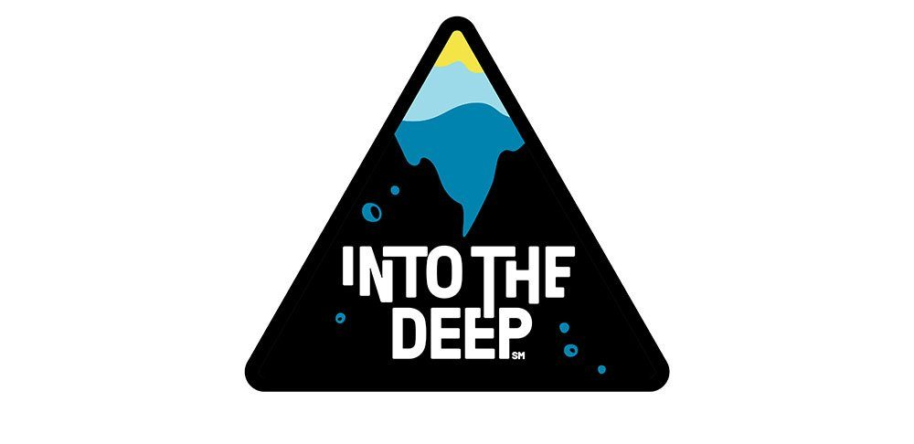
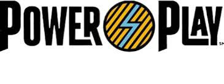
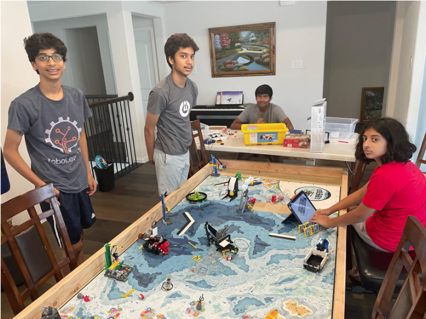

## My Robotics Journey

### **FIRST Tech Challenge Experience** 
I have participated in 5 years of FIRST Tech Challenge as the team captain and founder of the team. I also led the design and programming sub-teams.

**[YouTube Channel](https://www.youtube.com/@ftc18270/videos)**
**[Team Website](https://www.18270roboplayers.org/)**

 

---

{: .logo-image}

{: .robot-image}

After our first event, we were undefeated and were ranked number 1 in the world. In our first qualifier, we won the Inspire Award (the championship award), and the winning alliance captain, which are the two top awards given in any event. We also had the second highest score in the world. In our interleague tournament we also won the winning alliance captain, and were subsequently ranked as number 1 in north texas. In December, we had the solo world record, which we held for over a month. At the North Texas regional competition, we won the Inspire award (Championship award), which qualified us to the World Championships, as well as being ranked number 1 in North Texas for the robot game, and number 7 in the world. At Worlds, we were the Winning Alliance Captain and were one of the top 5 robots in the world. We qualified for the Maryland Tech Invitational in Johns Hopkins and as one of the 3 US teams invited to the Bucharest Twin Cup in Romania.

**[Code for the season](https://github.com/skandacode/IntoTheDeepV2)**
**[Interview with FUN Robotics Network](https://www.youtube.com/watch?v=a1bIDZJDJ5c)**
**[Former Solo World Record](https://www.youtube.com/watch?v=xO0BuFX0f84&ab_channel=FTCRoboPlayers)**
**[Onshape CAD Link](https://cad.onshape.com/documents/aebaa3ef6903293b21871485/w/9412eeae3624fe42ce363cc1/e/6d81e58ad25a991a5d27d1b4)**

 

---

 

{: .logo-image}

{: .robot-image}

We won our inter-league tournament, and won the motivate award (Helping others pursue STEM) in the regional competition. At the Texas State Championship we won the control award (Software algorithms), which qualified us to the World Championships. We qualified for the Maryland Tech Invitational in Johns Hopkins. 

**[Code for the season](https://github.com/skandacode/FtcRobotController)**
**[MTI Submission](https://www.youtube.com/watch?v=GI690EZx_BE)**
**[Onshape CAD Link](https://cad.onshape.com/documents/5072cf6460521fa37944e101/w/de839feb5dd34fbbbaa0c123/e/08065b1b154e35d30467b3fd)**

 

---
 

{: .logo-image}

{: .robot-image}

We won our inter-league tournament, and played the finals in the regional competition. We ranked 1st at the Texas State Championship, and won the event, placing us first in about 800 teams. We also placed 5th in our division at the World Championship. We qualified for the Maryland Tech Invitational in Johns Hopkins and had the most consistent autonomous in the entire event.  

**[MTI Submission](https://www.youtube.com/watch?v=8cJn8f_Pyw0)**
**[Behind the Bot Interview](https://www.youtube.com/watch?v=OdSXCAskOkE)**

 

---

 

**2021-2022 Freight Frenzy** - We were first ranked in the robot game, and won the  Control award and Inspire Award in our qualifier. We were ranked second in North Texas. Additionally, we were part of the winning alliance in our division after partnering with the number 1 ranked team. We put up the highest score in the region during eliminations. 

**2020-2021 Ultimate Goal** - We qualified to the regional championship after winning the first place Think Award at our qualifier. 

 

---

 

**FIRST Lego League** - I have participated in 3 years of FIRST Lego League as the team captain and founder of the team. 
- **2019-2020 City Shaper** - We were ranked 1st place in our qualifier and won the Championship Award. We placed 3rd and regionals and won the Championship award. Unfortunately, the World Championship was canceled due to the COVID-19 pandemic.
- **2018-2019 Into Orbit** - We were ranked 1st at our qualifer and our semi-regionals.
- **2017-2018 HydroDynamics** - First year of particatpating in robotics. We were ranked 1st in robot performance at our quaifiers and semi-regionals. We also ranked 3rd in the North Texas Region, qualifing us to the World Championship where we represented Texas. 

 

## Teaching Robotics Classes

### Primary Robotics and CAD Instructor (2022-2025)

- Taught over 200 students across grades 3-10 in competitive robotics and computer-aided design
- Raised over $8,000 annually through structured weekly educational programs
- Coached and mentored over 40 robotics teams across international locations
- Founded 22 competitive robotics teams that achieved multiple awards in North Texas regional competitions
- Teach a wide range of classes for different age groups, allowing students to move from one group to the next over multiple years

##### My Classes

- **Beginner Classes:** One-hour Saturday classes covering mechanical systems (gears, motors), basic programming concepts, and robot movement and control, held weekly for 3.5 years
- **Intermediate Classes:** FIRST Lego League (FLL) preparation focusing on modular attachments, programming, and presentation skills, held weekly for 3.5 years
- **CAD Classes:** Taught OnShape computer-aided design to 20 students covering part studios and assemblies for FIRST Tech Challenge participation weekly for 2 years
- **Summer FTC Classes:** 2.5 hour long classes designed to teach all of the technical aspects of FTC, like building, CAD, and programming. These classes were held every week for the entire summer

{: .demo-image}

## Robotics Stats
- Ranked 97th in FTC Hall of Fame globally
- We have quallified to the World Championships 4 times: Once in FIRST Lego League, and 3 times in FIRST Tech Challenge.
- Taught over 200 students building, programming, and design.
- Started 15 FIRST teams over 3 years of teaching roobtics

 